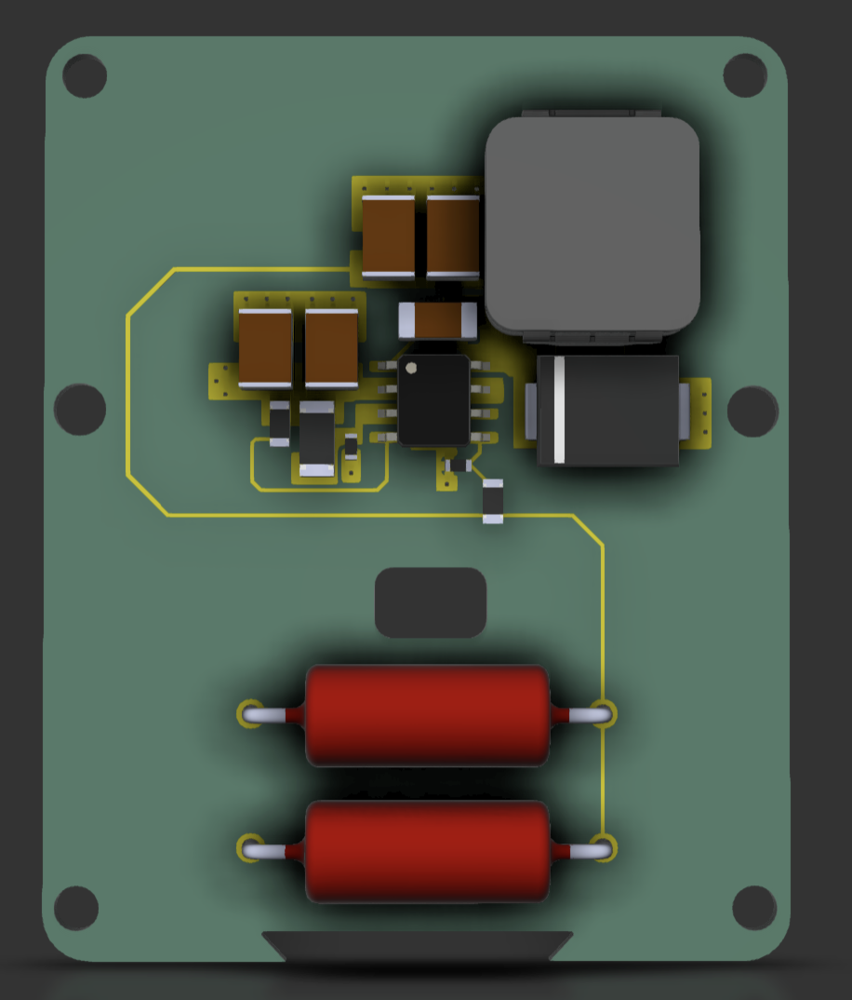
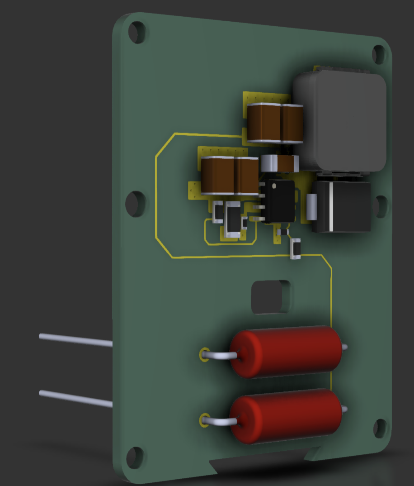
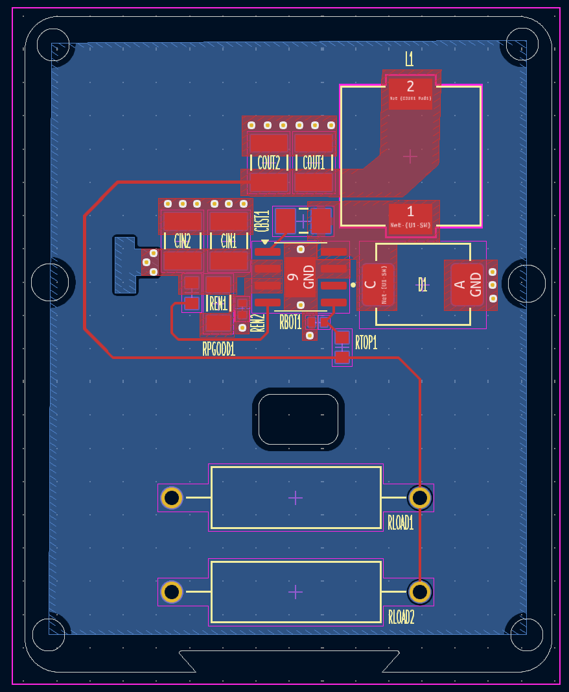

# CTS-SAT-1-Burnwire-PCB
This project focuses on developing a burnwire PCB mechanism for deployment of a composite lattice boom developed by Dr. Elderfield.

## ✩ Overview
This project involved designing a compact, reliable, and efficient burnwire system that can be activated electronically to sever a restraining wire, enabling deployment of the payload. The challenge was designing it to be compatable with both a burn resistor based mechanism of burning through the Dyneema wire and a direct connect of wire to board. 

  
## ⊹ Contributors
Brett 
Tristain 
Lara Musa

## Hopefully in the Future
I'm hoping to take another look at the trace width measurments,
review the mechanical structure,
and consukt someone on the footproints

## License
---------------------
